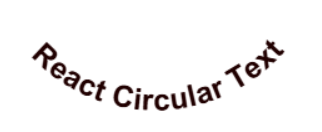

# 🌀 React Circle Text

A lightweight and flexible React component for rendering beautiful **circular text** on a canvas — perfect for profile frames, banners, posters, and more.



---

## Features

- Render text in **clockwise or counter-clockwise** directions  
- Fully customizable typography (font, weight, spacing, alignment)  
- RTL support (Right-to-Left languages)  
- Letter flipping for upright orientation  
- Text alignment: start / center / end  
- Export to **PNG or SVG** with callback support  
- Lightweight and framework-agnostic canvas renderer under the hood

---

## Installation

```bash
npm install react-circle-text
```

---

## Usage

```typescript
import { CircularText } from 'react-circle-text'

export default function Example() {
  return (
    <CircularText
      text="Hello Circular World!"
      radius={150}
      fontSize={24}
      fontFamily="Arial"
      fontWeight="bold"
      color="#0070f3"
      angleDeg={0}
      direction="clockwise"
      flip
      align="center"
    />
  )
}
```

---

## Props

| Prop              | Type                                      | Default            | Description                        |
|-------------------|-------------------------------------------|--------------------|-------------------------------------|
| **text**          | `string`                                 | –                  | The text to render                 |
| **radius**        | `number`                                 | `150`              | Circle radius                      |
| **fontSize**      | `number`                                 | `24`               | Font size in px                    |
| **fontFamily**    | `string`                                 | `Arial`            | Font family                        |
| **fontWeight**    | `string`                                 | `normal`           | Font weight                        |
| **color**         | `string`                                 | `#000`             | Text color                         |
| **angleDeg**      | `number`                                 | `0`                | Starting angle in degrees          |
| **direction**     | `'clockwise' \| 'counter-clockwise'`     | `'clockwise'`      | Text direction                     |
| **flip**          | `boolean`                                | `false`            | Keep letters upright               |
| **align**         | `'start' \| 'center' \| 'end'`           | `'center'`         | Text alignment                     |
| **rtl**           | `boolean`                                | `false`            | RTL support                        |
| **letterSpacing** | `number`                                 | `0`                | Additional space between letters   |
| **exportAs**      | `'png' \| 'svg'`                         | –                  | Optional export format             |
| **onExport**      | `(url: string) => void`                  | –                  | Callback fired after export        |

---

## Testing

This package uses **[Vitest](https://vitest.dev)** and **jsdom** for unit tests.

```bash
npm test
```

✅ Includes:

- Math utility tests  
- Canvas renderer smoke tests  
- Component render tests

---

## Development

```bash
# start playground / dev server
npm run dev

# run tests
npm test

# build package
npm run build
```

---

## License

MIT © Hovhannes Khachatryan

---

## Contributing / Feedback

Pull requests and feature suggestions are welcome!  
If you build something cool with this library, tag us or share a screenshot 😎
